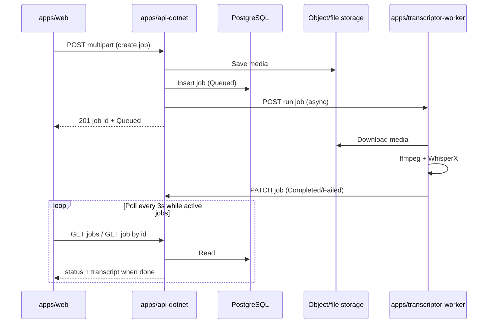

# Technical specification — Web transcription portal

**Pattern:** Flow-Based Solution (Pattern 1)

**Monorepo root:** `transcription/`

| App | Path | Role |
| --- | --- | --- |
| Web UI | `apps/web/` | React + TypeScript portal (no login v1) |
| API | `apps/api-dotnet/` | Job orchestration, persistence, file storage, public HTTP API |
| Worker | `apps/transcriptor-worker/` | Python FastAPI + [WhisperX](https://github.com/m-bain/whisperX) transcription |
| Infra | `infrastructure/` | Docker Compose, storage, networking for local/prod |

**Engineering guidelines:** `knowledge-base/Dev Docs/core-principles.md`, `core-principles-backend.md`, `core-principles-frontend.md`.

**v1 constraints (from feature docs):** no login; max file **2 GB**; common audio/video formats; concurrent jobs; export (download + copy) on completed jobs; plain transcript text only (no speaker labels / diarization UI in v1).

---

## System overview

The web app talks only to **api-dotnet**. The API stores uploaded media, persists job state in **PostgreSQL**, and triggers **transcriptor-worker** to run WhisperX. The worker reads media from storage, produces plain text, and reports completion back to the API. The web polls job list and detail until status is terminal.



---

## Components and responsibilities

### `apps/web/`

- Single main screen: job list (left) + workspace (right) per `specification-ux-ui.md`.
- **Screens:** `screens/transcription-portal/` (smart screen; uses API hooks).
- **Shared components (promote when reused):** job list row, upload zone, transcript panel, export toolbar.
- **Data:** TanStack Query (or project-standard hooks) against api-dotnet; poll list/detail while any job is `Queued` or `InProgress` (interval **3 seconds**; stop when all visible jobs are terminal).
- **Export:** Copy uses `navigator.clipboard` on transcript text from API; Download builds a client-side `.txt` blob (`{originalFileName}.txt`).
- **No auth headers** in v1.

### `apps/api-dotnet/`

- Vertical slice: `Features/TranscriptionJobs/` (Endpoint, Handler, Validator, Commands/Queries, Dtos).
- **Writes:** create job, accept upload, enqueue/trigger worker, apply worker callback.
- **Reads:** list jobs (newest first), get job by id (includes transcript when completed).
- **Persistence:** PostgreSQL + EF Core (`TranscriptionJob` entity).
- **Storage:** abstraction in `Infrastructure/` (local path for dev; S3-compatible or Azure Blob in prod via `infrastructure/`).
- **Internal endpoint** for worker callbacks (API key or shared secret; not exposed to browser).

### `apps/transcriptor-worker/`

- **FastAPI** service with WhisperX Python API (`whisperx.load_model`, `load_audio`, `transcribe`, optional `align` for segment boundaries).
- **v1 output:** flatten `segments[].text` into one plain string (paragraphs separated by newline); do **not** enable diarization in v1.
- **Video:** extract audio with **ffmpeg** before WhisperX.
- **Language:** auto-detect from WhisperX `transcribe` result (`language` field); no separate language picker in v1.
- **Hardware:** prefer GPU (`cuda`, `compute_type=float16`); fallback `cpu` + `int8` via configuration.
- Idempotent **run** handler keyed by `jobId`.

### `infrastructure/`

- Compose stack: PostgreSQL, API, worker, web, object storage (e.g. MinIO) for local dev.
- Network: worker and API on internal network; only API + web ports published to host.

---

## API Contracts

HTTP JSON uses **camelCase** on the wire (default ASP.NET Core serialization). Contract names below are **PascalCase** (C# DTOs). Property names in request/response examples in **Feature flow** follow camelCase.

### TranscriptionJobStatus

| Value | Meaning |
| --- | --- |
| `Queued` | Saved; worker not started or not yet picked up |
| `InProgress` | Worker acknowledged run |
| `Completed` | Transcript stored |
| `Failed` | Terminal error; `FailureReason` set |

### Upload validation (v1)

Validate **content type and extension** on API (reject before storage when possible):

`mp3`, `wav`, `m4a`, `aac`, `ogg`, `flac`, `mp4`, `mov`, `webm`, `mkv`, `avi`

Max size: **2_147_483_648** bytes (2 GB). Return `413` if larger.

### Public API — `TranscriptionJobListItemDto`

Used in list responses (`items[]`). No transcript text.

| Property | Type | Notes |
| --- | --- | --- |
| `Id` | `Guid` | Job identifier |
| `FileName` | `string` | Original upload name |
| `FileSizeBytes` | `long` | Size in bytes |
| `ContentType` | `string` | MIME type |
| `Status` | `TranscriptionJobStatus` | |
| `CreatedAt` | `DateTimeOffset` | UTC |
| `UpdatedAt` | `DateTimeOffset` | UTC |
| `CompletedAt` | `DateTimeOffset?` | Set when `Completed` |
| `FailureReason` | `string?` | User-safe message when `Failed` |

### Public API — `TranscriptionJobDetailDto`

Used in create (`201`) and get-by-id responses. Extends list fields with transcript when done.

| Property | Type | Notes |
| --- | --- | --- |
| _(same as list item)_ | | |
| `TranscriptText` | `string?` | Only when `Status` is `Completed` |
| `DetectedLanguage` | `string?` | ISO 639-1 from worker (optional) |

### Public API — `TranscriptionJobListResponseDto`

| Property | Type | Notes |
| --- | --- | --- |
| `Items` | `TranscriptionJobListItemDto[]` | Newest first |
| `Page` | `int` | |
| `PageSize` | `int` | |
| `TotalCount` | `int` | |

### Public API — `ValidationProblemDetails` / `ProblemDetails`

Standard error bodies for `400`, `404`, `413` (see Step 2 in Feature flow).

### Internal API — `RunTranscriptionJobRequest` (API → worker)

| Property | Type | Notes |
| --- | --- | --- |
| `JobId` | `Guid` | |
| `MediaDownloadUrl` | `string` | Signed URL |
| `FileName` | `string` | |
| `ContentType` | `string` | |

### Internal API — `UpdateTranscriptionJobRequest` (worker → API)

| Property | Type | Notes |
| --- | --- | --- |
| `Status` | `TranscriptionJobStatus` | Required |
| `TranscriptText` | `string?` | Required when `Completed` |
| `DetectedLanguage` | `string?` | Optional |
| `FailureReason` | `string?` | Required when `Failed` |

---

## Data Model

Persistence and domain shapes for **api-dotnet** (PostgreSQL via EF Core). Examples use **PascalCase** property names (C# entity / value object shape). The API maps entities to DTOs; the web never reads the database directly.

### TranscriptionJob

Single table `TranscriptionJobs`. One row per upload.

```json
{
  "Id": "3fa85f64-5717-4562-b3fc-2c963f66afa6",
  "FileName": "interview.mp3",
  "FileSizeBytes": 1048576,
  "ContentType": "audio/mpeg",
  "Status": "Queued",
  "StorageKey": "transcription-jobs/3fa85f64-5717-4562-b3fc-2c963f66afa6/source.mp3",
  "TranscriptText": null,
  "DetectedLanguage": null,
  "FailureReason": null,
  "CreatedAt": "2026-05-19T10:00:00Z",
  "UpdatedAt": "2026-05-19T10:00:00Z",
  "CompletedAt": null
}
```

**Completed example:**

```json
{
  "Id": "3fa85f64-5717-4562-b3fc-2c963f66afa6",
  "FileName": "interview.mp3",
  "FileSizeBytes": 1048576,
  "ContentType": "audio/mpeg",
  "Status": "Completed",
  "StorageKey": "transcription-jobs/3fa85f64-5717-4562-b3fc-2c963f66afa6/source.mp3",
  "TranscriptText": "Hello and welcome to the interview.\n\nToday we will discuss the project.",
  "DetectedLanguage": "en",
  "FailureReason": null,
  "CreatedAt": "2026-05-19T10:00:00Z",
  "UpdatedAt": "2026-05-19T10:15:00Z",
  "CompletedAt": "2026-05-19T10:15:00Z"
}
```

**Failed example:**

```json
{
  "Id": "7c9e6679-7425-40de-944b-e07fc1f90ae7",
  "FileName": "broken.mp4",
  "FileSizeBytes": 52428800,
  "ContentType": "video/mp4",
  "Status": "Failed",
  "StorageKey": "transcription-jobs/7c9e6679-7425-40de-944b-e07fc1f90ae7/source.mp4",
  "TranscriptText": null,
  "DetectedLanguage": null,
  "FailureReason": "Audio could not be processed. The file may be corrupted or unsupported.",
  "CreatedAt": "2026-05-19T11:00:00Z",
  "UpdatedAt": "2026-05-19T11:02:30Z",
  "CompletedAt": null
}
```

### Field reference

| Property | Type | Required | Notes |
| --- | --- | --- | --- |
| `Id` | `Guid` | Yes | Primary key |
| `FileName` | `string` | Yes | Max length 512 |
| `FileSizeBytes` | `long` | Yes | ≤ 2 GB |
| `ContentType` | `string` | Yes | Max length 128 |
| `Status` | `string` | Yes | `Queued`, `InProgress`, `Completed`, `Failed` |
| `StorageKey` | `string` | Yes | Object storage path; not exposed on public API |
| `TranscriptText` | `string` | No | Large text; null until completed |
| `DetectedLanguage` | `string` | No | Max length 16 |
| `FailureReason` | `string` | No | Max length 2000; user-safe text only |
| `CreatedAt` | `DateTimeOffset` | Yes | UTC |
| `UpdatedAt` | `DateTimeOffset` | Yes | UTC |
| `CompletedAt` | `DateTimeOffset` | No | Set when status becomes `Completed` |

### Status lifecycle

```text
Queued → InProgress → Completed
                   ↘ Failed
Queued → Failed        (worker unavailable after retries)
```

`StorageKey` is written at create time and not changed. `TranscriptText`, `DetectedLanguage`, and `CompletedAt` are set only on successful completion. `FailureReason` is set only on terminal failure.

---

## Feature flow

### Step 1 — Load portal and job list

| | |
| --- | --- |
| **Caller** | `apps/web` |
| **Endpoint** | `GET /api/v1/transcription-jobs` |
| **Query** | `page` (default 1), `pageSize` (default 50, max 100) |
| **Response** | Paginated list, sort `createdAt` descending |

**Response shape:**

```json
{
  "items": [
    {
      "id": "3fa85f64-5717-4562-b3fc-2c963f66afa6",
      "fileName": "interview.mp3",
      "fileSizeBytes": 1048576,
      "contentType": "audio/mpeg",
      "status": "InProgress",
      "createdAt": "2026-05-19T10:00:00Z",
      "updatedAt": "2026-05-19T10:01:00Z",
      "completedAt": null,
      "failureReason": null
    }
  ],
  "page": 1,
  "pageSize": 50,
  "totalCount": 12
}
```

**Read path rules:** no side effects; cache-friendly; used for left-column list.

---

### Step 2 — Upload file and create job

| | |
| --- | --- |
| **Caller** | `apps/web` |
| **Endpoint** | `POST /api/v1/transcription-jobs` |
| **Content-Type** | `multipart/form-data` |
| **Part** | `file` (required) |

**Handler flow (write path):**

1. Validate extension, content type, and size ≤ 2 GB.
2. Stream file to object storage; key pattern: `transcription-jobs/{jobId}/source.{ext}`.
3. Insert `TranscriptionJob` with `status = Queued`.
4. Return `201` immediately (do not block on WhisperX).
5. Fire-and-forget (or background queue) call to worker `POST /internal/v1/jobs/{jobId}/run`.

**Success response (`201`):**

```json
{
  "id": "3fa85f64-5717-4562-b3fc-2c963f66afa6",
  "fileName": "interview.mp3",
  "fileSizeBytes": 1048576,
  "contentType": "audio/mpeg",
  "status": "Queued",
  "createdAt": "2026-05-19T10:00:00Z",
  "updatedAt": "2026-05-19T10:00:00Z",
  "completedAt": null,
  "failureReason": null
}
```

**Validation errors (`400`):**

```json
{
  "type": "https://tools.ietf.org/html/rfc7231#section-6.5.1",
  "title": "Validation failed",
  "status": 400,
  "errors": {
    "file": ["Unsupported file type. Allowed: mp3, wav, m4a, aac, ogg, flac, mp4, mov, webm, mkv, avi."]
  }
}
```

**File too large (`413`):**

```json
{
  "title": "Payload too large",
  "status": 413,
  "detail": "Maximum file size is 2 GB."
}
```

**Concurrent jobs:** each upload creates a **new** job row; no global lock. Multiple `Queued` / `InProgress` jobs are expected.

---

### Step 3 — API triggers worker

| | |
| --- | --- |
| **Caller** | `apps/api-dotnet` (background) |
| **Endpoint** | `POST {WORKER_BASE_URL}/internal/v1/jobs/{jobId}/run` |
| **Auth** | Header `X-Internal-Api-Key: {shared secret}` |

**Request body:**

```json
{
  "jobId": "3fa85f64-5717-4562-b3fc-2c963f66afa6",
  "mediaDownloadUrl": "https://api.internal/storage/.../signed-url",
  "fileName": "interview.mp3",
  "contentType": "audio/mpeg"
}
```

`mediaDownloadUrl` is a **time-limited signed URL** (or internal URL reachable only from worker network) so the worker does not need DB access.

**Worker behavior:**

1. Return `202 Accepted` quickly if job accepted (idempotent: same `jobId` while `InProgress` → `202` without duplicate processing).
2. Set job `InProgress` via callback (Step 4) before heavy work.
3. Download media to temp disk; if video, run ffmpeg to mono WAV 16 kHz (WhisperX-friendly).
4. Run WhisperX pipeline (see **WhisperX integration** below).
5. On success: callback `Completed` + transcript text.
6. On failure: callback `Failed` + safe `failureReason` message (no stack traces to browser).

**API on worker unreachable:** leave job `Queued`; retry with exponential backoff (max 5 attempts) or mark `Failed` with reason `Worker unavailable` — implement retry in API infrastructure layer.

---

### Step 4 — Worker updates job (callback)

| | |
| --- | --- |
| **Caller** | `apps/transcriptor-worker` |
| **Endpoint** | `PATCH /api/internal/v1/transcription-jobs/{jobId}` |
| **Auth** | `X-Internal-Api-Key` |

**In progress:**

```json
{
  "status": "InProgress"
}
```

**Completed:**

```json
{
  "status": "Completed",
  "transcriptText": "Full plain text transcript...\n\nSecond paragraph...",
  "detectedLanguage": "en"
}
```

**Failed:**

```json
{
  "status": "Failed",
  "failureReason": "Audio could not be processed. The file may be corrupted or unsupported."
}
```

**Rules:**

- Ignore duplicate callbacks that would move terminal `Completed` / `Failed` back to `InProgress`.
- `transcriptText` max length: store in PostgreSQL `text` column; if over limit (e.g. 10 MB text), fail job with user-safe reason.
- `detectedLanguage` optional metadata for future use; web v1 may ignore.

---

### Step 5 — Poll job detail and show status

| | |
| --- | --- |
| **Caller** | `apps/web` |
| **Endpoint** | `GET /api/v1/transcription-jobs/{jobId}` |

**Response (`200`):**

```json
{
  "id": "3fa85f64-5717-4562-b3fc-2c963f66afa6",
  "fileName": "interview.mp3",
  "fileSizeBytes": 1048576,
  "contentType": "audio/mpeg",
  "status": "Completed",
  "createdAt": "2026-05-19T10:00:00Z",
  "updatedAt": "2026-05-19T10:15:00Z",
  "completedAt": "2026-05-19T10:15:00Z",
  "failureReason": null,
  "transcriptText": "Full plain text...",
  "detectedLanguage": "en"
}
```

- `transcriptText` is `null` unless `status === Completed`.
- While `Queued` or `InProgress`, UI shows spinner and does not render empty transcript body.

**Not found (`404`):** standard problem response; web shows generic error.

---

### Step 6 — Export (client-side, v1)

No dedicated download endpoint required for v1.

| Action | Behavior |
| --- | --- |
| **Copy** | Web copies `transcriptText` to clipboard; toast on success |
| **Download** | Web creates `Blob` `text/plain` and downloads `{fileNameWithoutExt}.txt` |

Optional later: `GET /api/v1/transcription-jobs/{jobId}/transcript.txt` with `Content-Disposition: attachment` if server-side audit is needed.

---

## WhisperX integration (worker)

**Library:** `whisperx` (PyPI / GitHub `m-bain/whisperX`).

**v1 pipeline (no diarization):**

1. `whisperx.load_audio(path)`
2. `model = whisperx.load_model(WHISPER_MODEL, device, compute_type=...)`
3. `result = model.transcribe(audio, batch_size=BATCH_SIZE)`
4. Optional alignment (improves segment boundaries; still flatten to plain text): `load_align_model(language_code=result["language"])`, `whisperx.align(...)`
5. Build `transcriptText` by joining segment texts with `\n`

**Configuration (environment):**

| Variable | Example | Notes |
| --- | --- | --- |
| `WHISPER_MODEL` | `large-v2` | Smaller model for dev (`base`) |
| `WHISPER_DEVICE` | `cuda` / `cpu` | |
| `WHISPER_COMPUTE_TYPE` | `float16` / `int8` | |
| `WHISPER_BATCH_SIZE` | `16` | Lower if GPU OOM |
| `FFMPEG_PATH` | `/usr/bin/ffmpeg` | Required for video inputs |

**Dependencies on worker image:** `ffmpeg`, CUDA toolkit when using GPU (see WhisperX README).

**Failure mapping (user-visible `failureReason`):**

| Condition | `failureReason` (example) |
| --- | --- |
| ffmpeg extract failed | `Could not read audio from this video file.` |
| CUDA OOM | `Processing failed due to resource limits. Try a smaller file or contact support.` |
| Unsupported/corrupt media | `Audio could not be processed. The file may be corrupted or unsupported.` |
| WhisperX internal error | Generic message; log full trace in worker logs only |

---

## API surface summary

| Method | Path | Auth | Purpose |
| --- | --- | --- | --- |
| `GET` | `/api/v1/transcription-jobs` | Public (v1) | List jobs |
| `GET` | `/api/v1/transcription-jobs/{id}` | Public (v1) | Job detail + transcript |
| `POST` | `/api/v1/transcription-jobs` | Public (v1) | Upload + create job |
| `PATCH` | `/api/internal/v1/transcription-jobs/{id}` | Internal key | Worker status update |

**v1 security note:** Public API has **no user login**. Deploy behind VPN or reverse-proxy allowlist for non-public environments. Rate-limit uploads per IP at gateway (recommended, not in app v1).

---

## CQRS mapping (api-dotnet)

| Operation | Type | Slice artifact |
| --- | --- | --- |
| Create job + upload | Command | `CreateTranscriptionJobCommand` + Handler |
| List jobs | Query | `ListTranscriptionJobsQuery` + Handler (read-only, no tracking side effects) |
| Get job by id | Query | `GetTranscriptionJobByIdQuery` |
| Apply worker update | Command | `UpdateTranscriptionJobStatusCommand` (internal endpoint) |

Register endpoints in `EndpointsConfiguration.cs`. Worker HTTP client in `Infrastructure/Transcription/`.

---

## Frontend mapping (apps/web)

| UI area | API / behavior |
| --- | --- |
| Left list | `GET /api/v1/transcription-jobs` + poll |
| Upload zone | `POST` multipart; show upload progress via `axios`/`fetch` progress event |
| Detail — processing | `GET` by id; show `status` |
| Detail — completed | render `transcriptText` + export toolbar |
| Detail — failed | show `failureReason` |
| New transcription while others run | reset right panel to upload; list shows all jobs |

Environment: `VITE_API_BASE_URL` (or project equivalent) pointing to api-dotnet.

---

## Failure modes (caller-visible)

| Scenario | HTTP / UI |
| --- | --- |
| Bad extension or type | `400` + field errors; inline alert in upload zone |
| File > 2 GB | `413`; inline alert |
| Network drop on upload | Client retry message; job not created |
| Worker down after create | Job stays `Queued` then `Failed` after retries; list shows Failed |
| Job failed | `failureReason` in detail; suggest new upload |
| GET unknown id | `404` |
| Poll while processing | Normal; 3s interval |
| Copy/export with empty transcript | Disable actions until `Completed` |

---

## Idempotency and retries

| Step | Rule |
| --- | --- |
| Worker `POST .../run` | Same `jobId` + already `InProgress` or terminal → no second full run |
| Worker callback | `Completed`/`Failed` is terminal; later duplicate callbacks ignored |
| API → worker trigger | At-least-once delivery acceptable; worker must be idempotent on `jobId` |

---

## Open decisions (confirm before build)

| Topic | Proposal | Alternative |
| --- | --- | --- |
| Message queue vs direct HTTP to worker | **Direct HTTP + callback** for v1 (simpler) | RabbitMQ / Azure Service Bus between API and worker |
| Storage | MinIO locally; cloud blob in prod | Filesystem-only dev |
| Polling interval | 3s | SSE / WebSocket later |
| Alignment step | **On** (better segments; still plain text export) | Transcribe-only for speed |
| Default Whisper model | `large-v2` prod, `base` local dev | Single model everywhere |

---

## Out of scope (technical, v1)

- User authentication and multi-tenant isolation
- Speaker diarization and word-level timestamps in API/UI
- Delete/cancel job endpoints
- Server-side transcript download endpoint (optional later)
- Search/filter on list API
