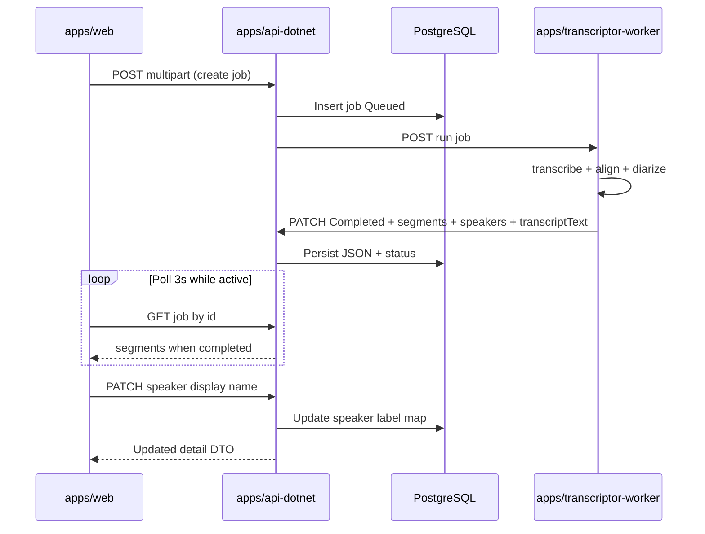

# Technical specification — Speaker diarization

**Pattern:** Flow-Based Solution (Pattern 1)

**Monorepo root:** `transcriptor/`

| App | Path | Role |
| --- | --- | --- |
| Web UI | `apps/web/` | Labeled transcript UI, rename, export with speakers/times |
| API | `apps/api-dotnet/` | Persist segments and speaker names; public read + rename; internal worker callback |
| Worker | `apps/transcriptor-worker/` | WhisperX transcribe + align + diarize; send structured result to API |
| Infra | `infrastructure/` | Docker Compose; add Hugging Face token for pyannote models |

**Engineering guidelines:** `knowledge-base/Dev Docs/core-principles.md`, `core-principles-backend.md`, `core-principles-frontend.md`.

**Extends:** Feature 1 (Web transcription portal). Same auth model (no login v1), same job lifecycle, same polling (3s while active).

**v1 product decisions (locked for implementation):**

| Topic | Decision |
| --- | --- |
| Time display | **Start–end** per segment, **24-hour**, relative to **file start** (`HH:MM:SS – HH:MM:SS`) |
| Single speaker | Still show **speaker label + time** on every segment row |
| Export line format | `[{start} – {end}] {displayName}: {text}` |
| Rename scope | One `speakerKey` per job; new name applies to **all segments** with that key |
| Display name rules | Trimmed, non-empty, max **64** characters |
| Diarization | **Always on** for every new job — no feature flag, no skip, no plain-text-only completion |
| Legacy jobs only | Jobs completed **before** this feature may have `hasDiarization: false`; UI uses `transcriptText` plain fallback (read-only) |

---

## System overview

Every **new** job runs the full pipeline: transcribe → align → **diarize** (mandatory). The worker must not complete a job without segments and speaker labels. On diarization failure, the job becomes **`Failed`** (same as transcription failure).

The worker sends **segments** (text, times, speaker key) plus a **speaker catalog** (default labels) to the API on success. The API stores JSON on the job row and still stores **`transcriptText`** (plain join of segment text) for export and legacy compatibility.

The web renders a **segment list** for completed jobs with diarization data. **Legacy** jobs without segments keep the plain `transcriptText` view. Copy/Download use labeled text when segments exist.



---

## Solution decisions

### Diarization engine (worker)

Use **WhisperX** with **pyannote** diarization (same stack as Feature 1):

1. `transcribe` → `align` → `DiarizationPipeline` → `assign_word_speakers` (all steps required for new jobs).
2. Read **segment-level** `start`, `end`, `text`, and `speaker` from the aligned result (do not expose word-level timestamps in API v1).
3. Map engine speaker ids (for example `SPEAKER_00`) to stable **`speakerKey`** strings stored in the API.
4. Set human-friendly **`defaultLabel`** values (`Person 1`, `Person 2`, …) in stable order of first appearance in the transcript.

**Configuration:** worker **requires** `HF_TOKEN` (read token) at startup and accepted Hugging Face model agreements for the diarization model WhisperX uses (see WhisperX README; community model `pyannote/speaker-diarization-community-1` or project-pinned equivalent). Missing token or failed diarization → job **`Failed`** with a user-safe `failureReason` (for example speaker detection could not run).

**No opt-out:** There is no `DIARIZATION_ENABLED` flag and no code path that skips diarization for new jobs.

### Persistence (API)

**v1 storage:** two JSON columns on `TranscriptionJobs` (EF Core migration):

| Column | Type | Content |
| --- | --- | --- |
| `TranscriptSegmentsJson` | `jsonb` / `text` | Array of segment objects (see contract) |
| `SpeakerLabelsJson` | `jsonb` / `text` | Map `speakerKey` → user `displayName` (only keys the user renamed; omit keys using default) |

**Why JSON for v1:** few writes per job (one worker callback + occasional renames), read-heavy detail view; avoids extra tables until reporting/query needs grow (YAGNI).

`HasDiarization` is **derived** when mapping to DTO: `true` when `TranscriptSegmentsJson` is non-empty array.

Keep existing `TranscriptText` column: worker sends joined plain text; API validates same max length as today (`10 MB`).

### Rename (API)

New **public write** endpoint under the existing feature slice. Command updates `SpeakerLabelsJson` only; **read queries** merge `displayName` = map value ?? `defaultLabel`.

**Rules:**

- Job must be `Completed` and `hasDiarization` true.
- `speakerKey` must exist in the job’s segment data.
- Idempotent: same name re-posted → `200` with unchanged detail.

---

## Contracts

HTTP JSON uses **camelCase** on the wire. Examples below use camelCase.

### `TranscriptSegmentDto` (public read)

| Field | Type | Notes |
| --- | --- | --- |
| `index` | `int` | 0-based order in transcript |
| `speakerKey` | `string` | Stable id, for example `SPEAKER_00` |
| `startSeconds` | `number` | Seconds from media start (float allowed) |
| `endSeconds` | `number` | `>= startSeconds` |
| `text` | `string` | Spoken text for this segment |

### `TranscriptionSpeakerDto` (public read)

| Field | Type | Notes |
| --- | --- | --- |
| `speakerKey` | `string` | Matches segments |
| `defaultLabel` | `string` | From worker, for example `Person 1` |
| `displayName` | `string` | Resolved label shown in UI (`displayName` override or `defaultLabel`) |

### Extended `TranscriptionJobDetailDto` (public)

Add to existing detail fields:

| Field | Type | Notes |
| --- | --- | --- |
| `hasDiarization` | `boolean` | `true` when segments are stored |
| `segments` | `TranscriptSegmentDto[]` | Present when `status === Completed` and `hasDiarization`; else `[]` or omit (pick one; recommend **empty array** for stable clients) |
| `speakers` | `TranscriptionSpeakerDto[]` | Distinct speakers for this job; empty when no diarization |

`transcriptText` behavior unchanged: set when `Completed`; used for fallback UI and plain export.

### Internal callback — `UpdateTranscriptionJobRequest` (worker → API)

Extend existing `PATCH /api/internal/v1/transcription-jobs/{id}` body:

```json
{
  "status": "Completed",
  "transcriptText": "Hello.\n\nThanks for joining.",
  "detectedLanguage": "en",
  "hasDiarization": true,
  "segments": [
    {
      "index": 0,
      "speakerKey": "SPEAKER_00",
      "startSeconds": 0.5,
      "endSeconds": 2.1,
      "text": "Hello."
    },
    {
      "index": 1,
      "speakerKey": "SPEAKER_01",
      "startSeconds": 2.5,
      "endSeconds": 5.0,
      "text": "Thanks for joining."
    }
  ],
  "speakers": [
    {
      "speakerKey": "SPEAKER_00",
      "defaultLabel": "Person 1"
    },
    {
      "speakerKey": "SPEAKER_01",
      "defaultLabel": "Person 2"
    }
  ]
}
```

**Failed (diarization or pipeline error):**

```json
{
  "status": "Failed",
  "failureReason": "Speaker detection could not be completed. Try another file or contact support."
}
```

**Validation when `status` is `Completed` (worker callback — new jobs only):**

- `transcriptText` required (existing rule).
- `hasDiarization` must be **`true`**.
- `segments` required, non-empty; each segment has `speakerKey`, `text`, `startSeconds`, `endSeconds`.
- `speakers` lists every `speakerKey` used at least once.
- Reject `Completed` without segments (`400` on internal callback) so partial results are never stored.
- Total JSON payload size cap: same order as transcript limit; if exceeded, set job `Failed` with user-safe `failureReason` (for example transcript too large).

**Legacy rows in the database** (completed before this feature) may have no segment JSON. The read API sets `hasDiarization: false` and returns `segments: []`; the worker must not create new rows in that shape.

### Rename speaker — request / response

**`PATCH /api/v1/transcription-jobs/{jobId}/speakers/{speakerKey}`**

Request:

```json
{
  "displayName": "Anna"
}
```

Success (`200`): full `TranscriptionJobDetailDto` with updated `speakers[].displayName` and unchanged `segments` (only labels change in resolved DTO).

**Errors:**

| Case | HTTP | Body |
| --- | --- | --- |
| Empty or whitespace name | `400` | `validation` on `displayName` |
| Name longer than 64 chars | `400` | `validation` on `displayName` |
| Job not found | `404` | ProblemDetails |
| Job not completed | `409` | ProblemDetails — cannot rename |
| Legacy job (no segment data) | `409` | ProblemDetails — rename not available |
| Unknown `speakerKey` | `404` | ProblemDetails — speaker not found |

---

## Feature flow

### Step 1 — Create job (unchanged entry)

Same as Feature 1: `POST /api/v1/transcription-jobs` multipart → `201` + `Queued`.

No new fields on create. Every new job uses the **full** worker pipeline including diarization (always on).

---

### Step 2 — Worker pipeline with diarization

| | |
| --- | --- |
| **Caller** | `apps/api-dotnet` → `apps/transcriptor-worker` |
| **Endpoint** | `POST {WORKER_BASE_URL}/internal/v1/jobs/{jobId}/run` |
| **Auth** | `X-Internal-Api-Key` |

**Processing steps:**

1. Download media; ffmpeg to mono 16 kHz WAV when video (unchanged).
2. `whisperx.load_audio` → `transcribe` → `align` → `DiarizationPipeline(token=HF_TOKEN, device=...)` → `diarize_model(audio)` → `assign_word_speakers(diarize_segments, result)`.
3. Build `segments[]` from result segments that have `text` and speaker assignment.
4. Build `speakers[]` with unique `speakerKey` and `defaultLabel` (`Person N` by first-appearance order).
5. Build `transcriptText` by joining segment `text` with `\n`.
6. `PATCH` API callback `Completed` with `hasDiarization: true` (Step 3).
7. On any step failure (including diarization): `PATCH` `Failed` + user-safe `failureReason`; do not call `Completed` without segments.

**Worker environment (add):**

| Variable | Required | Notes |
| --- | --- | --- |
| `HF_TOKEN` | **Yes** | Hugging Face read token; worker fails to start or rejects run if missing |

**Failure mapping:** Feature 1 messages for ffmpeg / WhisperX errors; add diarization-specific safe message when pyannote or speaker assignment fails (log details in worker only).

| Condition | `failureReason` (example) |
| --- | --- |
| Diarization model / HF auth failure | `Speaker detection could not be completed. Check service configuration or try again later.` |
| Diarization produced no labeled segments | `Speaker detection could not be completed for this file.` |

---

### Step 3 — Worker completion callback

| | |
| --- | --- |
| **Caller** | `apps/transcriptor-worker` |
| **Endpoint** | `PATCH /api/internal/v1/transcription-jobs/{jobId}` |
| **Auth** | `X-Internal-Api-Key` |

Handler (`UpdateTranscriptionJobStatusCommand`) extended to:

- Persist `TranscriptSegmentsJson`, `SpeakerLabelsJson` (clear labels on new completion).
- Set `TranscriptText`, `DetectedLanguage`, `CompletedAt` as today.
- Terminal state rules unchanged (ignore regressions from `Completed` / `Failed`).

---

### Step 4 — Poll job detail and render labeled transcript

| | |
| --- | --- |
| **Caller** | `apps/web` |
| **Endpoint** | `GET /api/v1/transcription-jobs/{jobId}` |

**Response with diarization (`200`):**

```json
{
  "id": "3fa85f64-5717-4562-b3fc-2c963f66afa6",
  "fileName": "meeting.mp3",
  "fileSizeBytes": 1048576,
  "contentType": "audio/mpeg",
  "status": "Completed",
  "createdAt": "2026-05-19T10:00:00Z",
  "updatedAt": "2026-05-19T10:20:00Z",
  "completedAt": "2026-05-19T10:20:00Z",
  "failureReason": null,
  "transcriptText": "Hello everyone.\n\nThanks for joining.",
  "detectedLanguage": "en",
  "hasDiarization": true,
  "segments": [
    {
      "index": 0,
      "speakerKey": "SPEAKER_00",
      "startSeconds": 0.5,
      "endSeconds": 2.8,
      "text": "Hello everyone."
    },
    {
      "index": 1,
      "speakerKey": "SPEAKER_01",
      "startSeconds": 3.0,
      "endSeconds": 5.5,
      "text": "Thanks for joining."
    }
  ],
  "speakers": [
    {
      "speakerKey": "SPEAKER_00",
      "defaultLabel": "Person 1",
      "displayName": "Person 1"
    },
    {
      "speakerKey": "SPEAKER_01",
      "defaultLabel": "Person 2",
      "displayName": "Person 2"
    }
  ]
}
```

**Read path rules:** no side effects; `GetTranscriptionJobByIdQuery` maps JSON → DTOs; resolves `displayName` from `SpeakerLabelsJson`.

**UI (`apps/web`):**

| State | Behavior |
| --- | --- |
| `Queued` / `InProgress` | Spinner only; no segment list |
| `Completed` + `hasDiarization` | `LabeledTranscript` list component; optional color by `speakerKey` |
| `Completed` + `!hasDiarization` | **Legacy jobs only:** info banner + `transcriptText` in `<pre>` (Feature 1) |
| Loading detail | Skeleton rows; do not flash plain then labeled |

**Time formatting (client):** format `startSeconds` / `endSeconds` to `HH:MM:SS` for display and export (floor seconds or round — pick one in UI tests; recommend **floor** for start, **ceil** for end).

---

### Step 5 — Rename speaker

| | |
| --- | --- |
| **Caller** | `apps/web` |
| **Endpoint** | `PATCH /api/v1/transcription-jobs/{jobId}/speakers/{speakerKey}` |
| **Body** | `{ "displayName": "Anna" }` |

**Handler flow (write path):**

1. Load job; verify `Completed` and segments exist.
2. Verify `speakerKey` appears in segments.
3. Upsert `SpeakerLabelsJson[speakerKey] = displayName` (trimmed).
4. Return `GetTranscriptionJobById` mapping (all segments keep same `speakerKey`; UI reads new `displayName` from `speakers[]`).

**UI:** modal or inline edit per UX spec; on success invalidate job detail query (TanStack Query).

---

### Step 6 — Export with labels (client-side)

No new download endpoint in v1.

| Action | Behavior |
| --- | --- |
| **Copy** | Build string from `segments` + resolved `displayName`; one line per segment: `[{start} – {end}] {displayName}: {text}` |
| **Download** | Same string as `text/plain` blob |
| **Legacy fallback** | If `!hasDiarization` (old jobs only), use `transcriptText` only (Feature 1) |

**Example export line:**

```text
[00:00:00 – 00:00:02] Anna: Hello everyone.
```

Helper lives in `apps/web` (for example `format-labeled-transcript.ts`); unit-test time formatting and line template.

---

## API surface summary

| Method | Path | Auth | Purpose |
| --- | --- | --- | --- |
| `GET` | `/api/v1/transcription-jobs` | Public (v1) | List jobs (unchanged) |
| `GET` | `/api/v1/transcription-jobs/{id}` | Public (v1) | Detail + segments/speakers |
| `POST` | `/api/v1/transcription-jobs` | Public (v1) | Upload + create job |
| `PATCH` | `/api/v1/transcription-jobs/{jobId}/speakers/{speakerKey}` | Public (v1) | Rename speaker display name |
| `PATCH` | `/api/internal/v1/transcription-jobs/{id}` | Internal key | Worker status + structured transcript |
| `DELETE` | `/api/v1/transcription-jobs/{id}` | Public (v1) | Unchanged (Feature 2) |

---

## CQRS mapping (api-dotnet)

| Operation | Type | Slice artifact |
| --- | --- | --- |
| Apply worker update (extended payload) | Command | `UpdateTranscriptionJobStatusCommand` |
| Get job by id (extended DTO) | Query | `GetTranscriptionJobByIdQuery` |
| Rename speaker | Command | `UpdateTranscriptionSpeakerLabelCommand` + `UpdateTranscriptionSpeakerLabelHandler` |

Register rename route in `TranscriptionJobsEndpoints` (or nested `MapGroup` for speakers).

---

## Frontend mapping (apps/web)

| UI area | API / behavior |
| --- | --- |
| Completed detail | `segments` + `speakers` → `LabeledTranscript` rows |
| Rename | `PATCH .../speakers/{speakerKey}` + cache invalidation |
| Export toolbar | `formatLabeledTranscript(detail)`; legacy jobs use `transcriptText` only |
| Types | Extend `TranscriptionJobDetail` in `api/types.ts` |
| Hooks | `useUpdateSpeakerLabel` mutation; existing poll on list/detail |

---

## Failure modes (caller-visible)

| Scenario | HTTP / UI |
| --- | --- |
| Diarization or `HF_TOKEN` failure | Job `Failed` + user-safe `failureReason`; no labeled transcript |
| Worker transcription failed | `Failed` + `failureReason` (unchanged) |
| Legacy job opened in UI | `Completed` + `hasDiarization: false`; banner + plain `transcriptText` (read-only) |
| Payload too large | `Failed` at callback; no partial segments |
| Rename on non-completed job | `409`; show error in rename UI |
| Rename unknown speaker | `404` |
| Invalid display name | `400`; inline validation before submit |
| GET unknown job | `404` |
| Poll while processing | No labeled rows until `Completed` |

---

## Idempotency and retries

| Step | Rule |
| --- | --- |
| Worker `POST .../run` | Same as Feature 1 — idempotent on `jobId` |
| Worker callback `Completed` | Terminal; duplicate callbacks ignored |
| Rename `PATCH` | Repeating same `displayName` is safe (`200`) |

---

## Out of scope (technical)

- Disabling diarization (config flag, env toggle, or “plain text only” completion for new jobs)
- Word-level timestamps in API/UI
- Merge/split speaker identities when diarization is wrong
- Cross-job speaker profile storage
- Server-side export endpoint
- Audio playback synced to timestamp clicks
- Filter transcript by speaker
- Re-run diarization on existing jobs without re-upload

---

## Open decisions (confirm before build)

| Topic | Proposal | Alternative |
| --- | --- | --- |
| JSON vs normalized tables | **JSON columns** on job row for v1 | `TranscriptSegments` + `TranscriptionJobSpeakers` tables |
| Segment granularity | One API row per WhisperX **segment** | Merge adjacent same-speaker segments in worker |
| `segments` on legacy read | **Empty array** `[]` when no stored JSON | Omit property |
